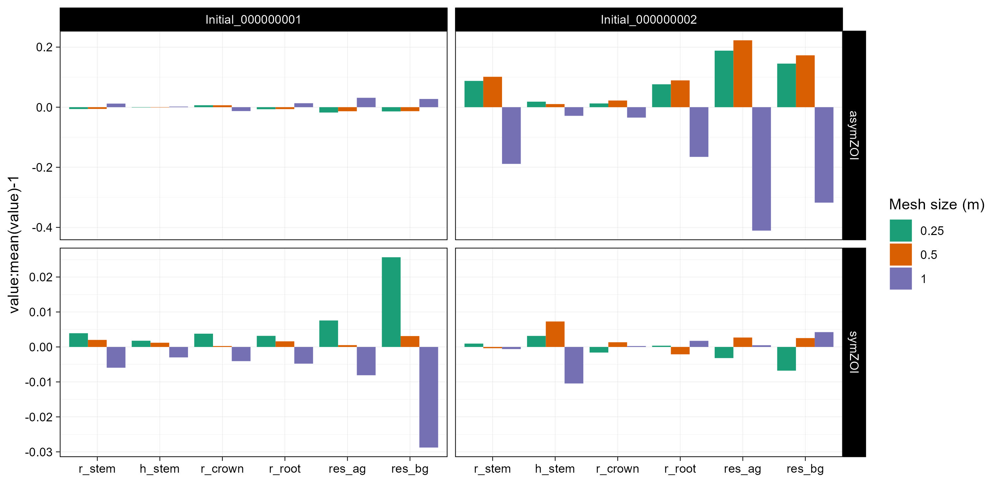

Effect of mesh size in ZOI modules (i.e., AsymmetricZOI and SymmetricZOI).

The figure shows the difference in geoemtry and above- and below-ground resources of the two BETTINA benchmark trees after ~126 years of simulation.
Resource availability is calculated using different mesh sizes.

The effect in the AsymmetricZOI module is greater than in the SymmetricZOI module (note: the scales of the y-axis are different in the figure below).

For symmetric ZOI (below-ground), differences are mainly apparent in the water uptake itself but not in plant size.
For asymmetric ZOI (above-ground), differences affect resource intake but also plant size, mainly of the smaller (plant 2) plant.

