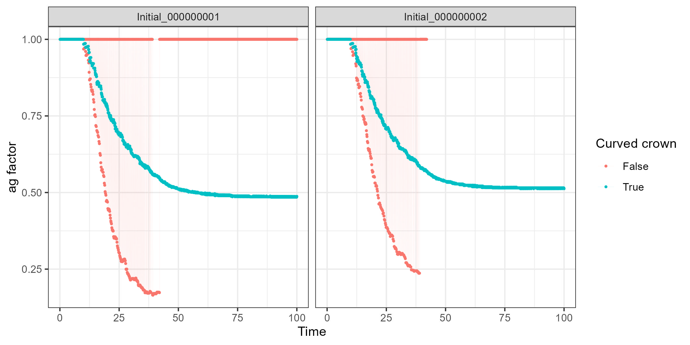
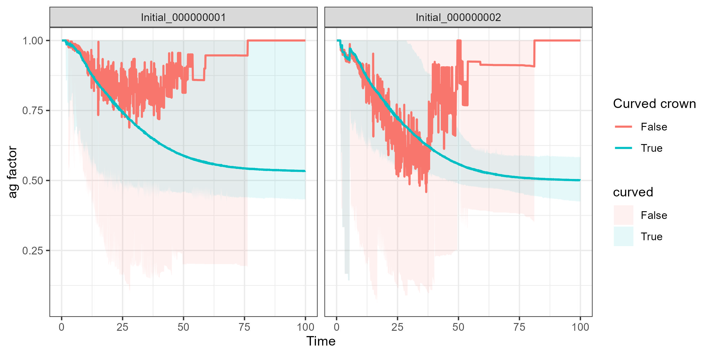
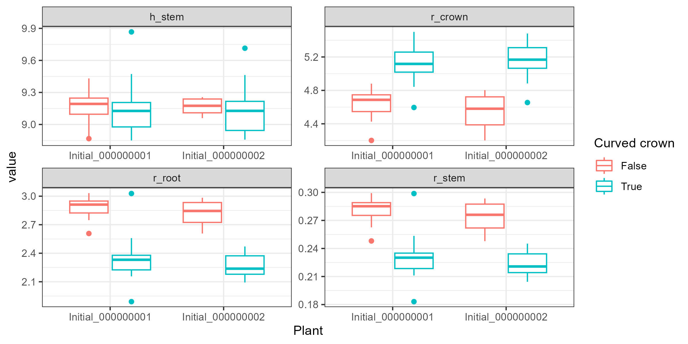

Effect of ``curved_crown`` tag in AsymmetricZOI module.

Without a curved crown, there are jumps when calculating the ag_factor.

See this example for 1 simulation:

See this example for a summary over all repetition (thick line: mean over all, ribbon: individual runs):

This eventually results in different geometries after 100 years of simulation:

Setup:
- 2 BETTINA trees randomly placed in a 5x5m² model domain, with a resolution of 20x20 cells
- No below-ground interaction
- 100 years simulation time
- 20 repetitions