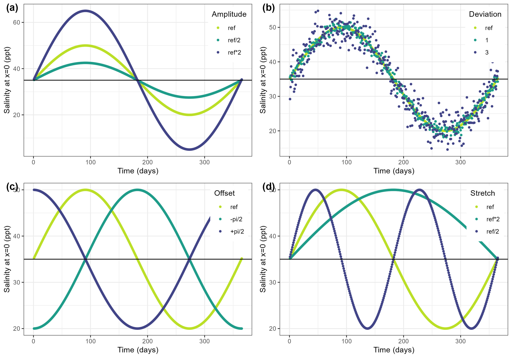

Effect of the parameters defining the salinity at each time step used in `FixedSalinity`.
This example shows how the parameters of the sine function impact salinity estimates at the border (at x=0). The panel show a change in (a) amplitude, (b) noise , (c) offset and (d) stretch. The reference (light green) has the following parameterization: s_i = 35e-3 (salinity at x=0), a = 15e-3 (amplitude), b = 3600 * 24 * 58 (stretch), c = 0 (offset), deviation = 0.

