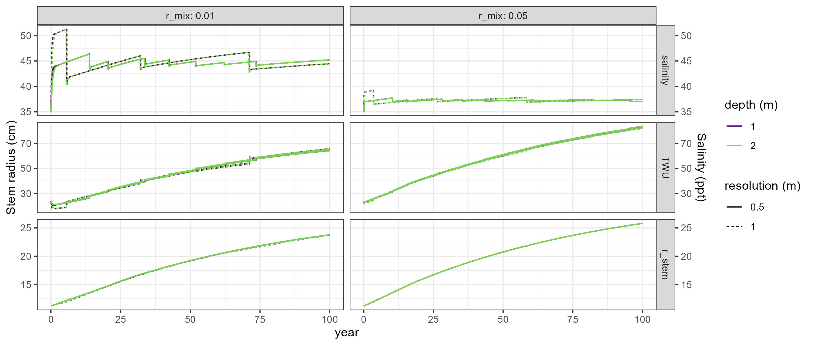
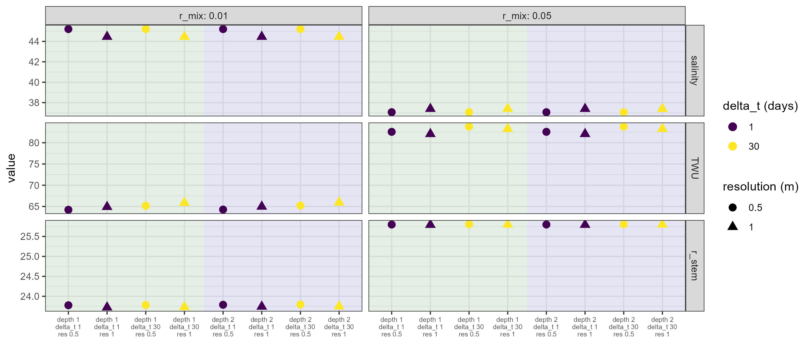
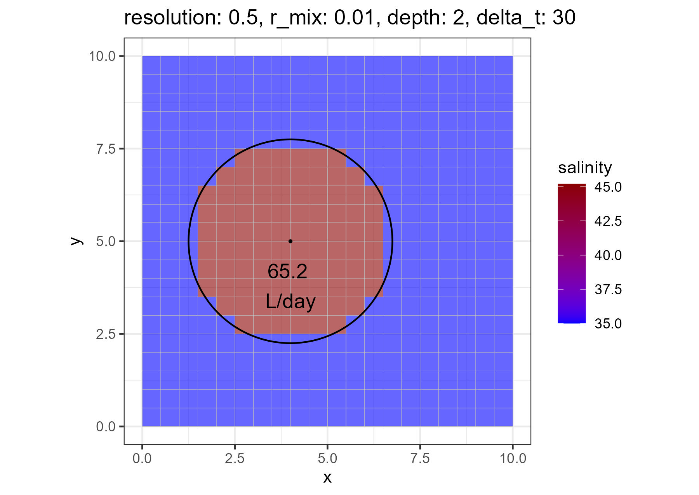

Sensitivity of input value in the `SaltFeedbackBucket` module.

The sensitivity of the model outputs salinity below the plant (`salinity`), plant water use (`TWU`) and stem radius (`r_stem`) against a variation in time step length (`delta_t`), grid resolution (`resolution`), mixing rate (`r_mix`) and aquifer thickness (`depth`) was tested in a single tree setup.
An increase in...
- ...`delta_t`: no effect
- ...`r_mix`: clear effect on `salinity` (increase, absolut and variation), thus higher `TWU` and `r_stem`
- ...`depth`: no effect
- ...`resolution`: small effect on `salinity` (decrease absolut but higher variation), barely any difference in `TWU` and `r_stem`

Output parameters after 100 years simulation time:

Topview for one tested example

